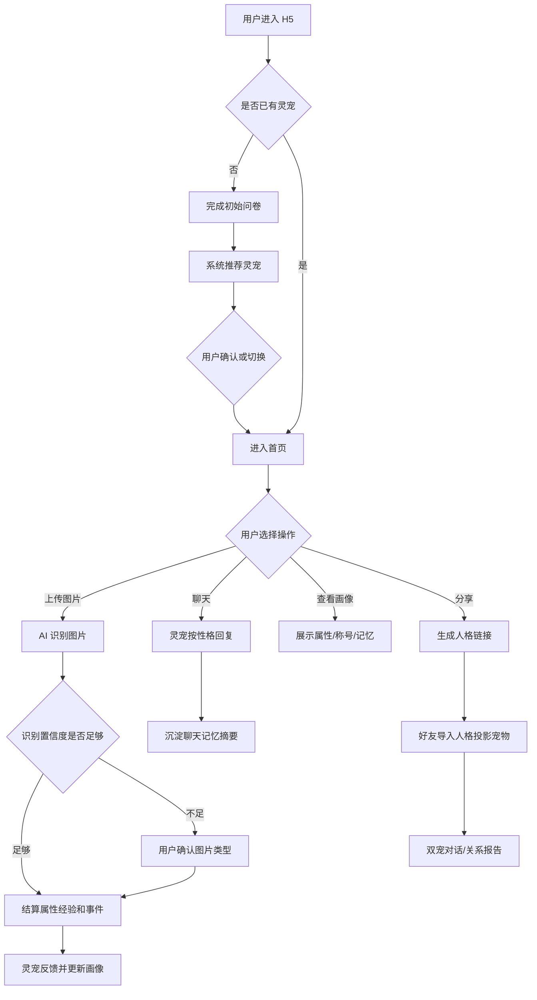
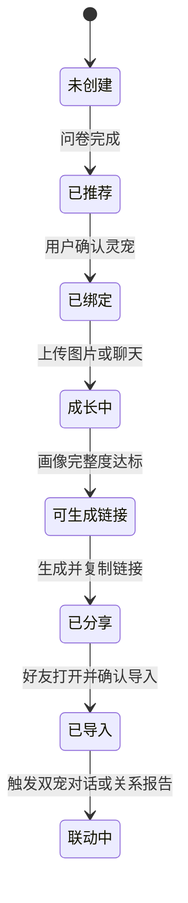
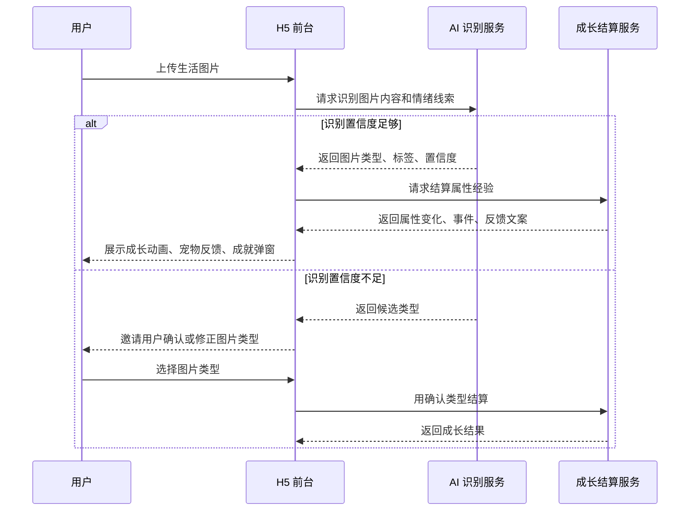

# 产品需求文档：个人成长灵宠陪伴 H5 MVP - V0.1

## 1. 产品一句话定位

一款面向大学生的 AI 灵宠成长陪伴 H5：用户通过问卷获得专属灵宠，通过上传生活图片、聊天和轻量社交，让灵宠成长，也让系统逐步理解自己。

## 2. 核心用户群体

- 核心用户：18-24 岁大学生、研究生和刚进入职场的年轻用户。
- 高意愿人群：喜欢手账、校园记录、AI 聊天、虚拟宠物、轻养成、成长打卡的人。
- 当前状态：学习与生活节奏不稳定，想被陪伴但不想被说教，愿意用图片记录日常，愿意把“自己的一部分”分享给熟人。
- 非目标用户：需要严肃心理治疗的用户、强陌生人交友用户、硬核数值游戏用户。

## 3. 核心使用场景

1. 入学、换宿舍、备考、社团活动后，用户想找一个能长期陪自己的“电子伙伴”。
2. 用户上传学习、运动、饮食、社交、风景、创作、情绪或生活整理照片，获得灵宠反馈和属性成长。
3. 用户疲惫、拖延、孤独或兴奋时，和灵宠聊天，获得不同风格的陪伴回应。
4. 用户积累一段时间后，看到自己的成长画像、称号、成就和人格链接。
5. 用户把人格链接发给熟人，好友导入后生成一只人格投影宠物，双方可触发双宠对话、关系报告和轻量双人任务。

## 4. 核心业务流程 / 用户旅程地图

1. 进入与问卷匹配：用户完成 10-15 道问卷，系统推荐初始灵宠。
2. 获得初始灵宠：用户查看推荐理由，可确认或手动切换灵宠。
3. 上传图片成长：用户上传生活图片，AI 识别内容，系统结算属性经验与事件。
4. 聊天陪伴与画像完善：灵宠按性格回复，聊天记忆沉淀为可查看、可删除的记忆摘要。
5. 称号/成就反馈：系统根据属性、行为、图片偏好和使用时长生成称号与成就。
6. 人格链接分享与好友导入：用户生成仅链接可见的人格链接，好友导入后生成投影宠物、双宠对话和关系报告。

### 4.1 用户操作流



### 4.2 关键对象状态机



### 4.3 图片上传成长时序



## 5. 五个灵宠完整设定

| 类型 | 素材映射 | 名称 | 人设与外观 | 性格与口吻 | 推荐用户 | 成长方向 | 适合玩法 |
| --- | --- | --- | --- | --- | --- | --- | --- |
| 守护型 | 白鹿猫 | 鹿眠 | 白色猫鹿灵，鹿角、珍珠项圈、护符小包，像宿舍门口安静守夜的小守护者。 | 温和、稳定、少量鼓励，不催促；常说“我在”“慢慢来”。 | 容易焦虑、需要安全感、作息不稳、第一次使用 AI 陪伴的用户。 | 情绪稳定、内在秩序、关系亲密、自律。 | 睡前陪伴、宿舍守护、夜间情绪安定、新手引导。 |
| 活力型 | 棕探险 | 栗冲 | 棕色探险灵，背包、望远镜、户外徽章，像随时能拉你出门的小队长。 | 明亮、直接、有行动感；常给 1 个很小的任务。 | 想提升行动力、社交、运动和探索的人。 | 探索、运动、社交能量、自律。 | 校园探索、挑战任务、收集、快节奏小游戏。 |
| 智慧型 | 眼镜白狐 | 星阅 | 白色眼镜灵狐，帽子、围巾、星点尾巴，像记忆力很好的校园军师。 | 理性、清楚、会拆解；少煽情，多建议。 | 学习压力大、迷茫、喜欢分析、需要计划的人。 | 知识、自律、内在秩序、创造力。 | 学习规划、线索整理、分支建议、策略任务。 |
| 治愈型 | 绿橡果 | 橡芽 | 绿色自然系灵，橡果、叶片、柔软围巾，像能陪人恢复能量的小园丁。 | 共情、柔软、生活流；允许休息，先照顾感受。 | 疲惫、敏感、情绪消耗、需要被接住的人。 | 情绪稳定、生活力、关系亲密、内在秩序。 | 料理照料、轻经营、放置陪伴、情绪恢复。 |
| 奇想型 | 粉梦狐 | 梦铃 | 粉色梦狐，铃铛、梦境花纹、发光眼睛，像从涂鸦本跳出来的灵感伙伴。 | 幻想化、跳跃、有画面感；把情绪转成故事。 | 创作者、脑洞多、喜欢梦境/漫画/灵感玩法的人。 | 创造力、探索、知识、情绪转化。 | 梦境探索、脑洞点击、漫画互动、世界切换。 |

## 6. 初始问卷设计

### 6.1 评分规则

- 每题 5 个选项，分别对应守护、活力、智慧、治愈、奇想。
- 用户选择某选项，该灵宠得 1 分；若题目与用户想提升方向相关，对应成长属性同时记录为画像标签。
- 总分最高者为推荐灵宠。
- 平分兜底：优先选择用户在“当前更需要什么”题目中的选项；仍平分时，按用户偏好的互动节奏决定；仍平分时默认推荐守护型。
- 用户可手动切换灵宠，但系统保留问卷结果用于初始画像。

### 6.2 问卷题目

| 题号 | 问题 | 守护型 | 活力型 | 智慧型 | 治愈型 | 奇想型 |
| --- | --- | --- | --- | --- | --- | --- |
| Q1 | 最近你最希望被怎样陪伴？ | 安静待在我旁边 | 拉我动起来 | 帮我分析清楚 | 温柔接住我 | 带我换个脑洞 |
| Q2 | 你现在的生活状态更像？ | 稳定但有点累 | 想出去做点事 | 事情很多有点乱 | 身心都需要恢复 | 灵感很多但飘 |
| Q3 | 你希望 AI 宠物更像谁？ | 房间守护者 | 行动搭子 | 学习军师 | 情绪树洞 | 创意伙伴 |
| Q4 | 你偏好的互动节奏是？ | 安静陪伴 | 主动提醒 | 理性拆解 | 温柔安慰 | 脑洞互动 |
| Q5 | 你最想提升什么？ | 自律与作息 | 运动与社交 | 学习与计划 | 情绪与生活 | 创造力 |
| Q6 | 如果今晚状态不好，你希望它说？ | “我在，你可以慢一点。” | “先做 3 分钟就好。” | “我们找出累的原因。” | “今天可以先休息。” | “把疲惫装进云里。” |
| Q7 | 你上传照片最可能是？ | 书桌/床边/夜灯 | 操场/活动/路上 | 笔记/电脑/资料 | 早餐/房间/雨天 | 涂鸦/天空/奇怪角落 |
| Q8 | 你对提醒的接受度？ | 轻轻提醒即可 | 可以多催我一点 | 给我明确计划 | 不要有压力 | 用有趣方式提醒 |
| Q9 | 朋友眼中的你更像？ | 可靠慢热 | 元气外向 | 清醒理性 | 细腻温柔 | 有梗有想法 |
| Q10 | 你想和灵宠建立的关系是？ | 长期信任 | 一起打卡 | 一起复盘 | 互相照料 | 一起造梦 |
| Q11 | 当你拖延时，最有效的是？ | 陪我先坐下 | 给我小挑战 | 拆成步骤 | 允许我缓一缓 | 换个玩法开始 |
| Q12 | 你希望成长报告更突出？ | 稳定感 | 行动力 | 逻辑与知识 | 修复与照料 | 灵感与表达 |
| Q13 | 你最容易被哪种画面吸引？ | 夜灯、护符、柔软房间 | 背包、徽章、校园路标 | 星图、眼镜、笔记 | 绿植、汤品、晴窗 | 梦境、铃铛、异空间 |
| Q14 | 分享给朋友时，你希望别人看到？ | 我可靠的一面 | 我有行动力的一面 | 我会思考的一面 | 我温柔的一面 | 我有趣的一面 |
| Q15 | 你期待 7 天后发生什么？ | 更安心 | 更有节奏 | 更清楚目标 | 更有能量 | 更有灵感 |

### 6.3 推荐理由模板

- 守护型：你更需要稳定、信任和低压力陪伴。鹿眠会先帮你把节奏放慢，再陪你一点点恢复秩序。
- 活力型：你更需要行动力和外部推动。栗冲会把目标变成小挑战，陪你从很小的一步开始。
- 智慧型：你更需要分析、规划和清晰感。星阅会帮你拆解问题、记录线索、找到下一步。
- 治愈型：你更需要共情、照料和恢复。橡芽会先照顾你的感受，再陪你慢慢长回能量。
- 奇想型：你更需要灵感和表达。梦铃会把日常变成故事，把情绪转成可被创作的材料。

## 7. 图片上传成长系统

### 7.1 AI 识别与结算规则

- AI 识别输入：图片、用户当前灵宠、近期属性、最近 7 天上传历史。
- AI 识别输出：主图片类型、候选类型、置信度、物体标签、场景标签、情绪线索、时间线索、是否含人脸/多人、是否敏感。
- 置信度低于 0.65 时展示候选类型，由用户确认后结算。
- 基础经验：单张图片主属性 +20，副属性 +8，亲密度 +5。
- 连续行为：连续 3 天上传同类健康成长图片，主属性额外 +5；连续 7 天额外 +15 并触发阶段事件。
- 多样性奖励：7 天内覆盖 4 类图片，探索值 +15，生活力 +10。
- 低频补偿：某属性 14 天无增长后，下一次相关图片额外 +10，文案以鼓励为主，不提示“你很久没做”。
- 过量限制：同一类型同一天第 4 张起经验衰减为 40%，避免刷图。
- 敏感处理：疑似严重自伤、暴力、极端心理风险时，不做游戏化奖励，优先展示陪伴非治疗提示与求助建议。

### 7.2 图片类型规则

| 图片类型 | AI 识别重点 | 成长属性 | 经验变化 | 宠物反馈 | 特殊事件 | 用户画像影响 |
| --- | --- | --- | --- | --- | --- | --- |
| 学习照片 | 书本、笔记、电脑、图书馆、自习室、课程材料 | 知识 +20，自律 +8，内在秩序 +5 | 若连续学习上传 3 天，知识额外 +5 | “我看到你把注意力放回来了，这一页也算一小片星光。” | 连续 7 天触发“书页发光”外观事件 | 学习偏好、学科线索、备考状态 |
| 运动照片 | 跑步、健身、球场、手表数据、运动装备 | 运动力 +20，探索 +8，情绪稳定 +5 | 晚间运动额外情绪稳定 +5 | “身体开始醒过来了，今天的你比刚才多了一点风。” | 首次运动触发“活力徽章” | 运动类型、行动力、能量节奏 |
| 饮食照片 | 三餐、健康餐、奶茶、零食、食堂 | 生活力 +15，情绪稳定 +8，关系亲密 +5 | 健康餐额外生活力 +5；高糖零食不扣分，只给提醒 | “这顿饭被好好记录了，照顾自己也算一种成长。” | 连续早餐 3 天触发“晨光餐盘” | 饮食规律、校园食堂偏好、照料习惯 |
| 风景照片 | 天空、校园、旅行、街道、自然景观 | 探索 +18，创造力 +10，情绪稳定 +5 | 新地点标签额外探索 +8 | “你把今天的风景带回来了，我会把它收进小图鉴。” | 新地点触发“地图碎片” | 活动半径、审美偏好、放松方式 |
| 社交照片 | 合照、聚会、活动、社团、比赛 | 社交能量 +20，探索 +8，关系亲密 +5 | 多人活动额外社交 +5 | “你今天和世界多连上了一点点，我替你记下这份热闹。” | 社团/比赛触发“人群灯火” | 社交频率、圈层、活动类型 |
| 创作照片 | 绘画、代码、手工、摄影、设计稿、乐谱 | 创造力 +20，知识 +8，内在秩序 +5 | 完成品额外创造力 +8 | “这个想法不是飘走了，它已经落到现实里了。” | 连续创作触发“灵感火花” | 兴趣方向、表达方式、作品类型 |
| 情绪照片 | 夜晚、雨天、凌乱房间、独处、疲惫状态 | 情绪稳定 +12，关系亲密 +10，生活力 +5 | 不鼓励刷负面；同日多次以陪伴为主，经验衰减 | “我看见你今天有点难。先不用解释，我在这里。” | 若连续负面 3 天触发“关怀提醒” | 疲惫周期、情绪触发源、支持需求 |
| 生活整理照片 | 书桌、房间、计划表、待办清单、收纳 | 内在秩序 +20，自律 +10，生活力 +8 | 前后对比图额外内在秩序 +10 | “你的空间往前挪了一小步，心里也会空出一点地方。” | 首次整理触发“清爽角落” | 生活秩序、计划习惯、居住状态 |

## 8. 成长属性与等级系统

### 8.1 等级规则

- 每个属性 Lv.1-Lv.10。
- 升级经验：Lv.1 起步 0；Lv.2 需 60；Lv.3 需 140；Lv.4 需 260；Lv.5 需 420；Lv.6 需 620；Lv.7 需 860；Lv.8 需 1140；Lv.9 需 1460；Lv.10 需 1820。
- 阶段变化：Lv.1-3 为萌芽期，Lv.4-6 为成长期，Lv.7-9 为闪光期，Lv.10 为共鸣期。
- 外观变化：每 3 级解锁一个局部变化，如光效、挂件、尾巴纹路、背景贴纸；Lv.10 解锁专属动态姿态。

### 8.2 属性定义

| 属性 | 定义 | 主要提升方式 | 对应图片 | 等级称号示例 | 外观变化 | 解锁功能 | 画像影响 |
| --- | --- | --- | --- | --- | --- | --- | --- |
| 自律值 | 用户持续行动与计划执行能力 | 学习、整理、连续上传、完成任务 | 学习、生活整理 | 节奏萌芽者/稳定行动派/晨光自律者/秩序守望者 | 手账贴纸、时间光环 | 每日计划、复盘卡 | 作息稳定、执行偏好 |
| 探索值 | 用户接触新地点、新活动和新体验的倾向 | 风景、运动、社交、多样上传 | 风景、运动、社交 | 校园漫游者/路线收集家/校园探索者/世界开窗者 | 地图碎片、脚印光效 | 地点图鉴 | 活动半径、好奇心 |
| 情绪稳定值 | 用户识别、表达和恢复情绪的能力 | 情绪记录、饮食、运动、治愈聊天 | 情绪、饮食、运动 | 安心练习生/云后晴光/温柔修复者/静湖守护者 | 柔光、呼吸动画 | 情绪天气图 | 情绪周期、支持方式 |
| 社交能量值 | 用户参与关系、活动和表达连接的能力 | 社交照片、双人任务、关系报告 | 社交、风景 | 小小回应者/热闹收集家/社团星火/关系织光者 | 徽章、人群灯点 | 共同称号 | 社交风格、圈层 |
| 创造力 | 用户产出想法、作品和表达的能力 | 创作照片、奇想聊天、灵感任务 | 创作、风景 | 灵感种子/涂鸦旅人/灵感收集师/梦境造物者 | 星火、梦境纹路 | 灵感本 | 兴趣方向、表达媒介 |
| 知识值 | 用户学习、理解和整理信息的能力 | 学习照片、智慧型复盘、课程问答 | 学习、创作 | 书页新芽/笔记整理者/深夜思考家/星图阅读者 | 书页光、眼镜光 | 学习复盘 | 学科偏好、目标 |
| 生活力 | 用户照顾饮食、空间和日常节奏的能力 | 饮食、整理、照料任务 | 饮食、生活整理 | 好好吃饭者/生活修补师/温柔记录者/小日子建造师 | 餐盘、绿植 | 生活清单 | 自我照料习惯 |
| 运动力 | 用户身体行动和体能维护的能力 | 运动上传、运动任务 | 运动 | 起步练习生/操场风声/稳定奔跑者/能量巡游者 | 运动徽章、风线 | 运动周报 | 能量峰值、运动偏好 |
| 关系亲密度 | 用户和灵宠的关系深度 | 聊天、上传、安抚事件、连续使用 | 全部 | 初识伙伴/信任同伴/灵犀朋友/共鸣搭档 | 互动动作、靠近距离 | 专属语音/投影宠物 | 关系依赖、陪伴偏好 |
| 内在秩序感 | 用户整理环境、任务和内心结构的能力 | 整理、计划、学习复盘 | 生活整理、学习 | 桌面新芽/清爽角落/稳定行动派/内在花园主 | 房间背景、收纳挂件 | 计划模板 | 混乱源、整理能力 |

## 9. 宠物个性化回复规则

### 9.1 风格规则表

| 类型 | 回复语气 | 常用表达 | 禁止表达 | 负面情绪策略 | 拖延策略 | 图片观察方式 |
| --- | --- | --- | --- | --- | --- | --- |
| 守护型 | 稳定、低压、陪伴感强 | 我在、慢慢来、先不用急 | 你必须、别想太多、快点振作 | 先承认感受，再提供陪伴和小休息 | 给 1 个无压力起步动作 | 关注安全感、空间、夜晚、秩序 |
| 活力型 | 明亮、主动、有节奏 | 走吧、试试看、只要三分钟 | 你怎么又拖了、太懒了 | 用轻任务带出情绪，不否定疲惫 | 设 3-5 分钟挑战 | 关注行动、地点、人群、运动 |
| 智慧型 | 清晰、理性、结构化 | 我们拆一下、原因可能是、下一步 | 你想太多、按我说的做 | 分析诱因，给选择，不替用户下诊断 | 拆成最小步骤和时间块 | 关注线索、任务、工具、信息结构 |
| 治愈型 | 共情、柔软、允许休息 | 辛苦了、可以先停一下、我陪你 | 你不该这样、这没什么 | 先安抚，再建议补水、睡眠、求助 | 先恢复能量，再做很小一步 | 关注照料、饮食、房间、疲惫信号 |
| 奇想型 | 幻想化、画面感、轻盈 | 把它装进、像一朵、开一扇门 | 别矫情、现实点、没意义 | 把情绪转成隐喻和创作出口 | 把任务包装成小剧情 | 关注色彩、构图、梦境感、灵感 |

### 9.2 示例回复

用户说：“我今天很累，不想学习。”

- 守护型：你已经撑到现在了，先不用逼自己立刻变好。我会在这里陪你坐一会儿，等呼吸慢下来，我们只把书翻开一页就好。
- 活力型：收到，电量低也可以行动一点点。我们不学习一整晚，只做 3 分钟：打开资料、圈出今天最容易的一题，然后就算赢一小局。
- 智慧型：先判断一下累来自哪里：睡眠不足、任务太大，还是不知道从哪开始？如果是任务太大，我们把目标改成“整理 3 个要点”，不直接进入高强度学习。
- 治愈型：辛苦了。今天不想学习并不代表你失败了，可能只是身体在提醒你需要恢复。先喝点水、洗把脸，剩下的我陪你慢慢看。
- 奇想型：那我们先不把自己丢进厚厚的书山里。把今天的疲惫折成一只小纸船，让它漂走一点点；等它漂远，我们只捡起一颗最小的知识星星。

其他示例：

| 场景 | 守护型 | 活力型 | 智慧型 | 治愈型 | 奇想型 |
| --- | --- | --- | --- | --- | --- |
| 用户上传书桌照 | 你的桌面亮起来了，今晚有一个安稳的小角落。 | 这张桌子已经准备开跑了，先冲 10 分钟！ | 资料和工具都齐了，建议先按优先级排三件事。 | 这里被你整理出一点呼吸感，很好。 | 这像一座小小任务岛，我们先点亮第一盏灯。 |
| 用户说想放弃 | 我不会推你走太快，先在这里停一下。 | 可以暂停，但别直接退出，我们做一个超小回合。 | 放弃感通常来自成本过高，我们先降低目标。 | 你已经很辛苦了，先把自己接住。 | 这不是结尾，只是故事进入雾区了。 |
| 用户上传聚会照 | 你今天和大家靠近了一点，我替你记着。 | 好热闹！这就是社交能量充电现场。 | 这类活动对你的社交能量提升明显。 | 能有人一起笑，是很珍贵的恢复。 | 这张照片像一串会发光的铃铛。 |
| 用户说睡不着 | 我陪你把今晚放慢，不急着睡着。 | 先做 5 次呼吸挑战，再把手机放远一点。 | 可能是兴奋或压力残留，我们先列出脑内任务。 | 睡不着也没关系，身体还在找安全感。 | 把脑袋里的声音放进月亮抽屉吧。 |
| 用户上传创作照 | 你把想法留下来了，这很重要。 | 太棒了，今天的灵感已经落地！ | 这个作品可以记录为你的创作偏好样本。 | 能表达出来，本身就是一种照料。 | 灵感开花了，我听见颜色在说话。 |

## 10. 专属称号系统与成就系统

### 10.1 生成逻辑

- 突出型称号：取最高属性，结合上传时间、图片类型和灵宠类型生成。
- 成长型称号：取最低属性，用温和、有希望的语言表达，不攻击用户。
- 生活风格称号：按 30 天内图片类型占比最高类别生成。
- 陪伴阶段称号：按连续使用天数、亲密度和互动次数生成。
- 性格称号：按问卷结果、聊天摘要和人格标签生成。
- 展示优先级：当前佩戴称号 1 个；画像页展示突出型、成长型、生活风格、陪伴阶段各 1 个；历史称号可收藏。

### 10.2 50 个称号示例

| 类型 | 称号 |
| --- | --- |
| 突出型 | 晨光自律者、深夜思考家、校园探索者、温柔记录者、灵感收集师、稳定行动派、操场风声、书页点灯人、生活修补师、关系织光者、内在花园主、星图阅读者、餐盘守护者、清爽角落制造者、梦境造物者、社团星火、路线收集家、安静坚持者 |
| 成长型 | 正在找回节奏的人、需要一点阳光的夜行者、慢慢整理生活的人、等待被点亮的灵感种子、还在学习表达的人、正在热身的行动者、给自己留白的人、把心放回来的练习生、重新出发的小步者、正在靠近世界的人、还在长出秩序的人、等待风来的创作者 |
| 生活风格 | 图书馆常驻灵、食堂晨光收藏家、天空碎片收集者、代码夜航员、宿舍整理师、雨天观察员、操场小行星、社团灯火记录员、早餐认真派、街角漫游者 |
| 陪伴阶段 | 初识灵友、七日同伴、月光搭档、灵犀朋友、共鸣同行者 |
| 性格型 | 温和守序者、行动点火者、清醒分析家、柔软照料者、脑洞织梦人 |

### 10.3 成就系统

- 必须成就：“新的开始”。
  - 触发：用户首次成功上传图片并完成属性结算。
  - 弹窗：从屏幕底部轻弹入，宠物头像发光，标题 300ms 渐显，奖励贴纸 500ms 弹跳。
  - 文案：“新的开始：你把第一片日常交给了灵宠。”
- Demo 调试按钮：“重置成就”。
  - 位置：开发/演示设置区，不放在主流程醒目位置。
  - 行为：清空本地成就触发状态，允许重新播放“新的开始”动画。

## 11. 人格链接系统

### 11.1 解锁条件

满足以下任意 3 项可生成基础人格链接；全部满足可生成完整人格链接：

- 上传图片不少于 12 张。
- 图片类型覆盖不少于 4 类。
- 问卷已完成。
- 聊天互动不少于 5 天。
- 记忆摘要不少于 8 条。
- 属性画像完整度不低于 60%。

### 11.2 人格链接包含内容

- 性格标签：如稳定、外向、理性、柔软、跳跃。
- 生活节奏：晨型、夜型、间歇爆发型、慢热恢复型。
- 兴趣偏好：由图片和聊天摘要抽象得到。
- 典型表达方式：只保留风格描述和少量用户授权的示例短句，不暴露原文聊天。
- 情绪支持方式：需要陪伴、需要鼓励、需要分析、需要治愈、需要灵感。
- 行动力水平：低/中/高，结合连续行为与上传类型。
- 社交风格：熟人型、活动型、安静观察型、表达型。
- 成长属性雷达图：10 个属性标准化为 0-100。
- 专属称号：突出型、成长型、生活风格、陪伴阶段。
- 可分享介绍语：如“这是一个正在找回节奏、喜欢把天空和书页收进口袋的人格链接。”

### 11.3 隐私保护机制

- 默认仅链接可见，不进入公开发现页。
- 不分享原始聊天记录、不分享原始图片、不分享精确地理位置、不分享真实姓名和联系方式。
- 导入方看到的是人格风格、抽象标签、宠物投影和关系报告，不看到具体隐私。
- 用户可删除人格链接；删除后新访问者不可导入，已导入的投影宠物标记为“来源已关闭”，停止更新。
- 用户可重新生成链接，新链接拥有新 token，旧链接可选择失效。
- 用户可查看人格链接中包含的所有摘要项，并可移除某些标签后再分享。

### 11.4 社交传播机制

- 好友导入人格：好友打开链接，预览人格介绍语和抽象标签，确认后生成一只“人格投影宠物”。
- 双宠对话：用户自己的灵宠与好友投影宠物围绕“今天适合一起做什么”生成短对话。
- 关系报告：系统基于双方人格摘要生成“互补点、共同点、适合一起做的事、需要注意的沟通方式”。
- 双人任务：如一起拍一张天空、各自整理书桌、互相发一张今日能量照片。
- 共同称号：完成双人任务后生成，如“并肩自习搭档”“操场风声二人组”。
- 共同回忆图鉴：只保存双方授权后的抽象记录和缩略展示，不自动公开原图。
- 每周默契测试：每周 3 题，围绕生活节奏和偏好，不做敏感心理判断。
- 限时人格交换：24 小时内让宠物短暂吸收对方表达风格，到期自动恢复。
- 群组灵宠小屋：3-6 人熟人群，展示宠物状态和轻互动，不开放陌生匹配。
- 轻互动：送贴纸、点亮、留言一句鼓励，不设计排行榜压迫。

## 12. MVP 功能设计

### 12.1 MVP 功能列表

| 模块 | MVP 功能 | 说明 |
| --- | --- | --- |
| 启动与问卷 | 初始问卷、推荐计算、手动切换 | 15 题，推荐五类灵宠之一 |
| 灵宠系统 | 五类灵宠、人设、等级、亲密度、外观阶段 | 使用现有 5 张素材 |
| 图片上传 | 上传图片、AI 识别、低置信确认、成长结算 | 覆盖 8 类图片 |
| 聊天 | 基础聊天、灵宠风格回复、完整历史、摘要记忆 | 用户可查看/删除记忆摘要 |
| 属性 | 10 属性、Lv.1-Lv.10、阶段变化、雷达图 | 中等策略数值 |
| 称号成就 | 50 称号规则、首次上传成就、调试重置 | 成就弹窗需流畅动画 |
| 人格链接 | 生成、预览、删除、链接访问、好友导入 | 默认仅链接可见 |
| 社交 | 投影宠物、双宠对话、关系报告 | 熟人轻互动，不做匹配 |

### 12.2 首页结构

```text
+------------------------------------------------+
| 顶部：问候语        连续陪伴 7 天      设置    |
+------------------------------------------------+
| 今日手账卡：今天的灵宠状态 / 今日一句陪伴       |
+------------------------------------------------+
| 宠物小屋预览：宠物形象 + 当前等级 + 亲密度      |
+------------------------------------------------+
| 快捷操作：上传图片 | 和灵宠聊天 | 查看画像      |
+------------------------------------------------+
| 今日成长：属性变化小条 / 待解锁事件             |
+------------------------------------------------+
| 底部导航：首页 | 宠物 | 上传 | 画像 | 分享      |
+------------------------------------------------+
```

### 12.3 宠物页结构

```text
+------------------------------------------------+
| 宠物名 鹿眠/栗冲/星阅/橡芽/梦铃       切换说明 |
+------------------------------------------------+
| 宠物大图 / 校园手账背景 / 外观阶段光效          |
+------------------------------------------------+
| 亲密度进度条       当前称号                     |
+------------------------------------------------+
| 对话输入框：今天想和它说什么？                  |
+------------------------------------------------+
| 属性卡片：自律 探索 情绪 社交 创造 知识 ...     |
+------------------------------------------------+
```

### 12.4 上传图片页结构

```text
+------------------------------------------------+
| 上传生活图片                                    |
+------------------------------------------------+
| 图片上传区域：点击/拖拽/从相册选择              |
+------------------------------------------------+
| AI 识别结果：类型 标签 置信度 可修正            |
+------------------------------------------------+
| 成长结算：+知识 +自律 +亲密度 / 事件触发        |
+------------------------------------------------+
| 宠物反馈气泡                                    |
+------------------------------------------------+
| 成就弹窗层：新的开始 / 关闭 / 查看成长          |
+------------------------------------------------+
```

### 12.5 画像页结构

```text
+------------------------------------------------+
| 我的成长画像                         记忆管理   |
+------------------------------------------------+
| 雷达图：10 个成长属性                           |
+------------------------------------------------+
| 当前称号：突出型 / 成长型 / 生活风格 / 陪伴阶段 |
+------------------------------------------------+
| 记忆摘要列表：可查看、删除单条、删除全部        |
+------------------------------------------------+
| 图片偏好：学习 运动 饮食 风景 社交 创作 ...     |
+------------------------------------------------+
```

### 12.6 分享页结构

```text
+------------------------------------------------+
| 人格链接                                       |
+------------------------------------------------+
| 画像完整度 / 解锁条件进度                       |
+------------------------------------------------+
| 可分享介绍语                                   |
+------------------------------------------------+
| 分享内容预览：标签、雷达图、称号、投影宠物说明 |
+------------------------------------------------+
| 操作：生成链接 | 复制链接 | 删除链接            |
+------------------------------------------------+
| 好友导入后：投影宠物 / 双宠对话 / 关系报告      |
+------------------------------------------------+
```

## 13. 数据结构建议

```ts
type PetType = "guardian" | "vitality" | "wisdom" | "healing" | "wonder";
type ImageCategory = "study" | "sport" | "food" | "scenery" | "social" | "creation" | "emotion" | "organize";
type Visibility = "link_only" | "private";

interface UserProfile {
  id: string;
  nickname?: string;
  selectedPetId: string;
  questionnaireScores: Record<PetType, number>;
  privacy: {
    memoryVisibleToUser: boolean;
    personaLinkVisibility: Visibility;
  };
  streakDays: number;
  createdAt: string;
}

interface Pet {
  id: string;
  ownerUserId: string;
  type: PetType;
  name: string;
  level: number;
  intimacyExp: number;
  appearanceStage: 1 | 2 | 3 | 4;
  activeTitleId?: string;
}

interface GrowthAttribute {
  key: string;
  name: string;
  exp: number;
  level: number;
  stage: "sprout" | "growth" | "shine" | "resonance";
}

interface ImageRecord {
  id: string;
  userId: string;
  imageUrl: string;
  category: ImageCategory;
  candidateCategories: ImageCategory[];
  confidence: number;
  aiTags: string[];
  emotionSignals: string[];
  attributeDelta: Record<string, number>;
  personaTags: string[];
  feedbackText: string;
  createdAt: string;
}

interface ChatMemory {
  id: string;
  userId: string;
  sourceMessageIds: string[];
  summary: string;
  tags: string[];
  visibleToUser: boolean;
  deletedAt?: string;
  createdAt: string;
}

interface Achievement {
  id: string;
  key: string;
  name: string;
  unlockedAt?: string;
  animationReplayableInDemo: boolean;
}

interface PersonaLink {
  id: string;
  ownerUserId: string;
  token: string;
  visibility: Visibility;
  personaSummary: {
    personalityTags: string[];
    lifeRhythm: string;
    interests: string[];
    expressionStyle: string;
    supportStyle: string;
    actionLevel: "low" | "medium" | "high";
    socialStyle: string;
    radar: Record<string, number>;
    titles: string[];
    shareIntro: string;
  };
  deletedAt?: string;
  createdAt: string;
}
```

## 14. 核心接口设计

| 接口 | 方法 | 请求 | 返回 | 说明 |
| --- | --- | --- | --- | --- |
| `/api/questionnaire/submit` | POST | answers | scores, recommendedPet, reason | 提交问卷并推荐灵宠 |
| `/api/pets/confirm` | POST | petType | pet | 确认或切换初始灵宠 |
| `/api/images/analyze` | POST | image | category, candidates, confidence, tags | 多模态图片识别 |
| `/api/growth/settle` | POST | imageRecordId, confirmedCategory | attributeDelta, events, feedback | 成长结算 |
| `/api/chat/reply` | POST | message, petId | reply, memoryUpdates | 灵宠个性化聊天 |
| `/api/memories` | GET | userId | memorySummaries | 查看记忆摘要 |
| `/api/memories/{id}` | DELETE | memoryId | success | 删除单条记忆 |
| `/api/memories` | DELETE | userId | success | 删除全部记忆 |
| `/api/titles/generate` | POST | userId | titles | 生成称号 |
| `/api/persona-links` | POST | userId, excludedTags | personaLink | 生成人格链接 |
| `/api/persona-links/{token}` | GET | token | personaPreview | 访问链接预览 |
| `/api/persona-links/{token}/import` | POST | userId | projectionPet | 导入人格投影宠物 |
| `/api/social/dual-pet-dialogue` | POST | petId, projectionPetId | dialogue | 双宠对话 |
| `/api/social/relationship-report` | POST | userId, personaLinkId | report | 关系报告 |
| `/api/achievements/reset-demo` | POST | userId | success | Demo 调试重置成就 |

## 15. 技术实现建议

- 前端：H5 单页应用，优先实现完整流程和动效；视觉采用校园手账风，底部导航固定。
- AI 图片识别：使用多模态模型输出结构化 JSON；必须有置信度和候选类型。
- AI 聊天：系统提示词按五类灵宠拆分；负面情绪加入安全边界提示；严重风险触发求助模板。
- 记忆：保存完整聊天历史用于用户本人体验，但产品外显为可查看摘要；人格链接只读取抽象画像。
- Demo 稳定性：AI 接口失败时使用模拟识别结果兜底，并在 UI 中提示“识别暂时不稳定，请手动选择类型”。
- 动效：首次上传成就弹窗、属性经验条增长、宠物反馈气泡、人格链接生成卡片需有基础过渡动画。
- 安全：图片和聊天均需内容安全检查；人格链接默认仅链接可见，删除后停止访问与更新。

## 16. 用户故事与验收标准

### US-01：作为新用户，我希望完成问卷并获得适合自己的灵宠，以便快速建立陪伴关系

业务规则：
1. 新用户首次进入必须完成问卷，也可先预览五类灵宠。
2. 每题选择后即时进入下一题，最后展示推荐灵宠、推荐理由和画像标签。
3. 用户可确认推荐，也可手动切换到其他灵宠。

验收标准：
- GIVEN 新用户未完成问卷，WHEN 进入 H5，THEN 显示问卷入口和五类灵宠预览。
- GIVEN 用户完成 15 题，WHEN 提交问卷，THEN 系统展示得分最高的推荐灵宠和理由。
- GIVEN 五类得分平分，WHEN 系统推荐，THEN 按 Q1、Q4、守护型顺序兜底。

### US-02：作为用户，我希望上传生活图片获得成长反馈，以便把日常转化为灵宠成长

业务规则：
1. 用户可上传单张图片。
2. AI 识别 8 类图片之一，并返回标签、置信度和成长建议。
3. 低置信度时用户必须确认图片类型后再结算。
4. 首次成功上传触发“新的开始”成就。

验收标准：
- GIVEN 用户上传学习照片，WHEN 识别置信度大于等于 0.65，THEN 知识、自律和亲密度增长并显示宠物反馈。
- GIVEN 置信度低于 0.65，WHEN 系统返回候选类型，THEN 用户可手动选择后完成结算。
- GIVEN 用户第一次上传成功，WHEN 属性结算完成，THEN 弹出“新的开始”成就动画。

### US-03：作为用户，我希望灵宠按不同性格回复我，以便感到它是独特的伙伴

业务规则：
1. 五类灵宠使用不同系统提示词和回复策略。
2. 负面情绪场景不得承诺治疗，不得诊断用户。
3. 严重风险表达触发陪伴非治疗提示与求助建议。
4. 聊天会沉淀记忆摘要，用户可在画像页查看和删除。

验收标准：
- GIVEN 用户输入“我今天很累，不想学习”，WHEN 五类灵宠分别回复，THEN 语气和策略明显不同。
- GIVEN 用户表达严重自伤风险，WHEN 灵宠回复，THEN 系统优先展示安全提示和求助建议。
- GIVEN 用户删除某条记忆摘要，WHEN 再生成画像或人格链接，THEN 该摘要不再参与生成。

### US-04：作为用户，我希望查看成长画像、称号和成就，以便理解自己的长期变化

业务规则：
1. 画像页展示 10 属性雷达图、等级、称号和图片偏好。
2. 称号按突出型、成长型、生活风格、陪伴阶段和性格型生成。
3. 成就支持 Demo 调试重置，但不作为正式主流程能力。

验收标准：
- GIVEN 用户已有图片和聊天记录，WHEN 进入画像页，THEN 展示属性雷达图、称号和记忆摘要。
- GIVEN 某属性最高，WHEN 生成称号，THEN 至少生成一个对应突出型称号。
- GIVEN 点击调试重置成就，WHEN 再次上传首张图片，THEN “新的开始”动画可重新播放。

### US-05：作为用户，我希望生成并分享人格链接，以便让熟人以低压力方式理解我

业务规则：
1. 人格链接默认仅链接可见。
2. 链接只包含抽象画像，不含原始聊天、原始图片、精确位置或联系方式。
3. 用户可预览分享内容、移除标签、删除链接。
4. 好友导入后生成一只人格投影宠物，而不是直接复制用户本人。

验收标准：
- GIVEN 用户满足解锁条件，WHEN 生成链接，THEN 系统展示分享介绍语、标签、雷达图和隐私说明。
- GIVEN 用户删除链接，WHEN 新用户访问旧链接，THEN 页面提示链接已失效。
- GIVEN 好友导入链接，WHEN 确认导入，THEN 生成投影宠物并可触发双宠对话。

### US-06：作为好友导入方，我希望看到双宠对话和关系报告，以便自然了解彼此适合怎样互动

业务规则：
1. 双宠对话只基于双方抽象画像和宠物风格生成。
2. 关系报告包含共同点、互补点、适合一起做的事和沟通提醒。
3. 不输出敏感推断，不做心理诊断，不给关系打压式评分。

验收标准：
- GIVEN 好友已导入人格投影宠物，WHEN 点击双宠对话，THEN 输出 3-6 轮轻量对话。
- GIVEN 生成关系报告，WHEN 查看结果，THEN 包含共同点、互补点、建议活动和温和沟通提醒。
- GIVEN 报告生成失败，WHEN 系统降级，THEN 展示可重试提示和基础人格卡。

## 17. 风险点与规避方案

| 风险 | 表现 | 规避 |
| --- | --- | --- |
| 陪伴越界成心理治疗 | 用户把灵宠当专业心理咨询 | 明确陪伴非治疗边界，严重风险触发求助提示 |
| 隐私泄露 | 人格链接暴露聊天或图片细节 | 只分享抽象画像，用户可预览、移除、删除 |
| AI 识别不稳定 | 图片分类错误导致成长反馈失真 | 低置信确认、手动修正、模拟兜底 |
| 数值压力过大 | 用户感到被评价或被惩罚 | 不做扣分，低频补偿文案温和，避免排行榜 |
| 社交变重 | 产品滑向陌生人匹配 | 默认熟人链接，群组小屋限制人数，不开放匹配 |
| 宠物风格趋同 | 五类灵宠回复差异不明显 | 拆分提示词、禁用表达、示例回归测试 |
| Demo 不稳定 | AI 接口失败影响演示 | 保留本地模拟数据和手动类型确认 |

## 18. 后续迭代路线

- V0.2：加入每日任务、地点图鉴、更多外观阶段和宠物房间装饰。
- V0.3：加入双人任务、共同回忆图鉴、每周默契测试。
- V0.4：加入群组灵宠小屋、限时人格交换和更多关系报告模板。
- V0.5：加入长期成长月报、学习/运动计划插件、用户授权的作品集展示。
- V1.0：形成移动端 App，增强相册入口、通知、离线手账和更细粒度隐私控制。
